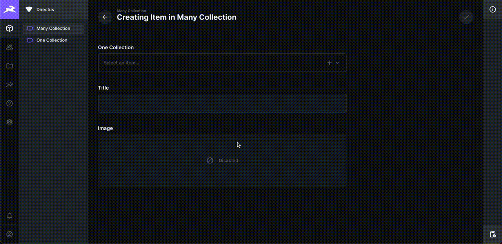
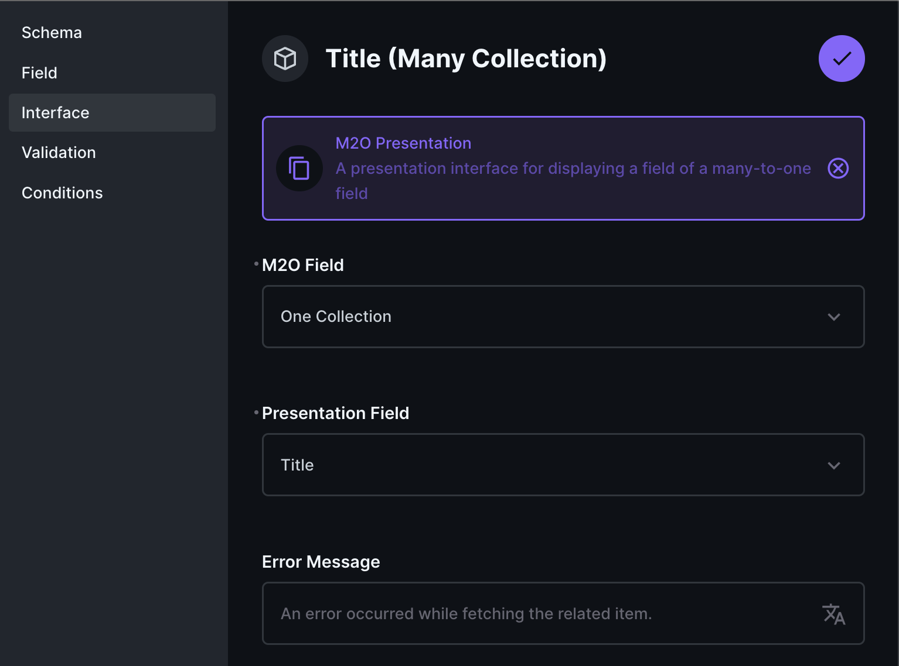

# Introduction

Sometimes, the Many to One interface is not enough, you want to show the fields inside it in the outside form. If that's the case, this extension is for you.

The **M2O Presentation** extension is a presentation interface that allows to display a field of a many-to-one field to the outside form.





# Installation
```
npm i directus-extension-m2o-presentation-interface
```

# Get Started
1. Go to **Settings**, create a new presentation field.
2. In the **Interface** panel, choose **M2O Presentation** interface. There are 2 options:
    1. **M2O Field**: Select a field in the same collection that has M2O relationship.
    2. **Presentation Field**: Select a field in the related collection for display.
    3. **Error Message**: A user-friendly message when error occured.
